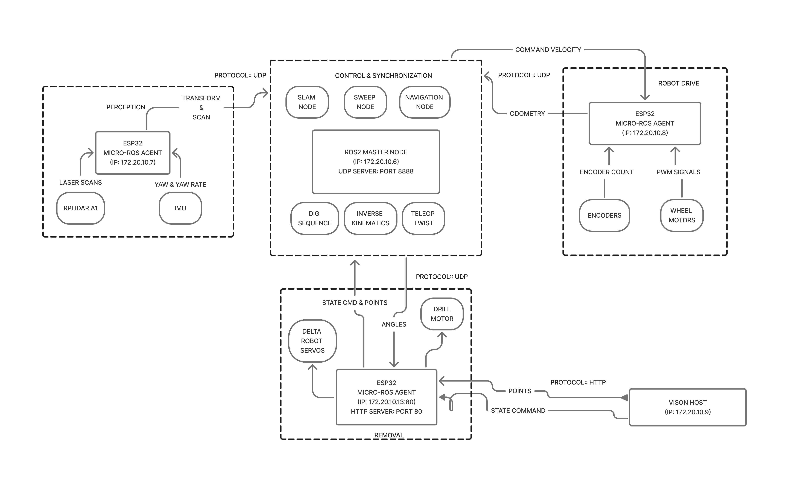

# Weedbot Delta

<table>
  <tr>
    <td></td>
    <td></td>
  </tr>
</table>

This repository contains the firmware and micro ROS glue for the delta robot end effector on the same weeding robot shown earlier. It is a focused slice of the larger project **Control and Navigation of a Weeding Robot**. The complete system includes the four wheel differential drive base, perception using IMU and LiDAR, and higher level control such as sweep coverage, SLAM, and autonomous navigation.

### Overall System Architecture


## Scope
**Servo angle control with smoothing** for three delta joints, calibrated pulse mapping per servo.  
**Spinner motor control** for the auger, forward, reverse, stop.  
**ROS 2 integration via micro ROS** over Wi Fi UDP to a host agent.  
**Topic bridge and lightweight HTTP interface** for sweep and dig triggers.

## Architecture

* **Hardware**: ESP32, three hobby servos for the delta arms, H bridge for the drill motor  
* **Middleware**: micro ROS on the ESP32, ROS 2 Humble on the host  
* **Transport**: UDP between agent and node  
* **Topics**:  
  * subscribes to `/joint_angles_point` `geometry_msgs/Point` where x y z are joint angles in degrees  
  * subscribes to `/spinner_cmd` `std_msgs/Float32` where 1.0 forward, 2.0 reverse, 0.0 stop  
  * publishes `/dig_target` `geometry_msgs/Point` for higher level sequences  
  * publishes `/sweep_cmd` `std_msgs/Float32` for simple start or stop

The delta ESP32 acts as a micro ROS client. The ROS 2 agent runs on a laptop or small computer on the same network and bridges DDS traffic. The same robot chassis and delta arm appear in the system image above.

## Folder Structure

```text
src/
├── config.cpp            # Wi Fi credentials and agent address definitions
├── servo_mapper.cpp      # degree to microseconds mapping with per servo calibration
├── delta_controller.cpp  # attach servos, write angles, smooth motion
├── spinner.cpp           # H bridge control for the drill motor
├── delta_http.cpp        # tiny HTTP interface for sweep and dig
├── delta_node.cpp        # Wi Fi, micro ROS, pubs subs, executor, HTTP polling
└── main.cpp              # tiny entry point

include/
├── config.h              # declarations for Wi Fi and agent, pins and constants
├── servo_mapper.h
├── delta_controller.h
├── spinner.h
├── delta_http.h
└── delta_node.h
```
## Quick Start