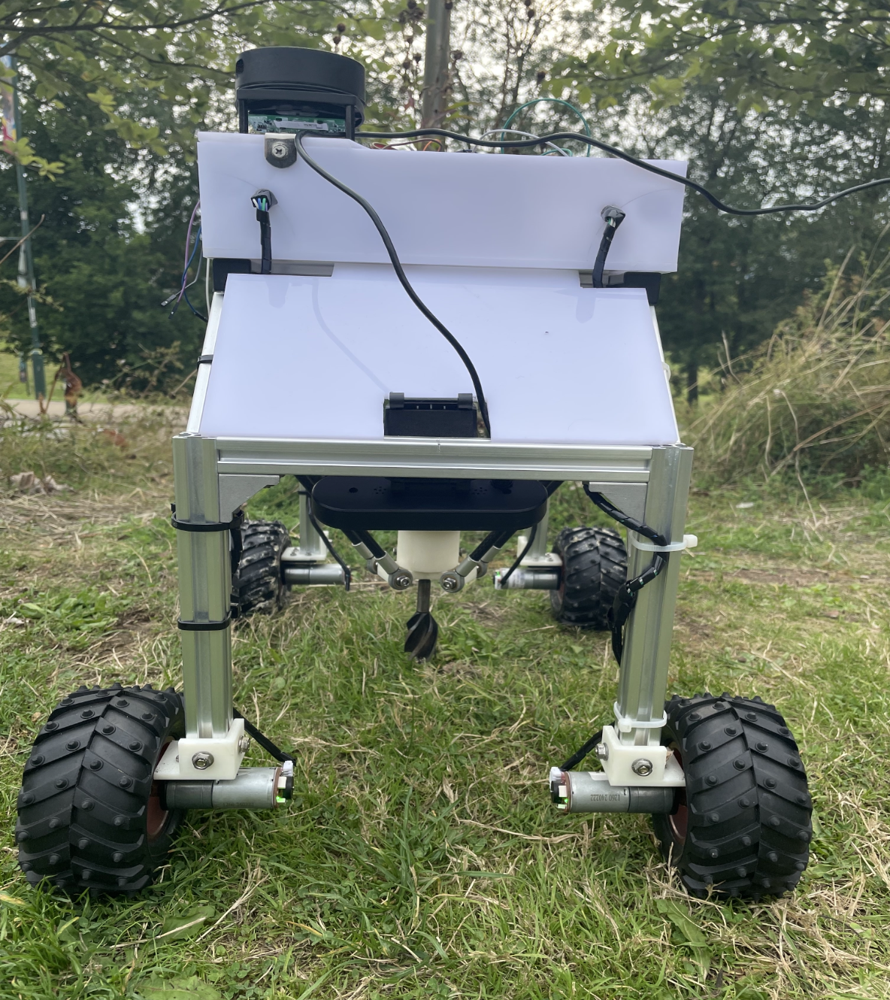

# Weedbot Delta

<table>
  <tr>
    <td></td>
    <td></td>
  </tr>
</table>

This repository contains the Micro ROS firmware for the delta robot end effector on the weeding robot shown above. It is a focused slice of the larger project **Control and Navigation of a Weeding Robot**. The complete system includes the four wheel differential drive base, perception using IMU and LiDAR, and higher level control such as sweep coverage, SLAM, and autonomous navigation.

### Overall System Architecture


## Scope
**Servo angle control with smoothing** for three delta joints, calibrated pulse mapping per servo.  
**Spinner motor control** for the auger style end effector, forward, reverse, stop.  
**ROS 2 integration via micro ROS** over Wi Fi UDP to a host agent.  
**Topic bridge and lightweight HTTP interface** for sweep and dig triggers.

## Architecture

* **Hardware**: ESP32, three DS3235SG servos for the delta arms, L298N H bridge for the RSPRO drill motor  
* **Middleware**: micro ROS on the ESP32, ROS 2 Humble on the host  
* **Transport**: UDP between agent and node  
* **Topics**:  
  * subscribes to `/joint_angles_point` `geometry_msgs/Point` where x y z are joint angles in degrees  
  * subscribes to `/spinner_cmd` `std_msgs/Float32` where 1.0 forward, 2.0 reverse, 0.0 stop  
  * publishes `/dig_target` `geometry_msgs/Point` for higher level sequences  
  * publishes `/sweep_cmd` `std_msgs/Float32` for simple start or stop of the sweep mode

The ESP32 connected to the delta robot acts as a micro ROS client. The ROS 2 agent runs on a laptop or small computer on the same network and bridges DDS traffic. The same robot chassis and delta arm appear in the image above.

## Folder Structure

```text
src/
├── config.cpp            # Wi Fi credentials and agent address definitions
├── servo_mapper.cpp      # degree to microseconds mapping with per servo calibration
├── delta_controller.cpp  # attach servos, write angles, smooth motion
├── spinner.cpp           # H bridge control for the drill motor
├── delta_http.cpp        # HTTP interface for sweep and removal control
├── delta_node.cpp        # Wi Fi, micro ROS, pubs subs, executor, HTTP polling
└── main.cpp              # entry point

include/
├── config.h              # declarations for Wi Fi and agent, pins and constants
├── servo_mapper.h
├── delta_controller.h
├── spinner.h
├── delta_http.h
└── delta_node.h
```

## Quick Start

1. **Edit configuration** 

Update `include/config.h` for pins and constants. Set Wi Fi and agent in `src/config.cpp`

```code
// src/config.cpp
const char* WIFI_SSID = "your_ssid";
const char* WIFI_PASS = "your_pass";
const IPAddress AGENT_IP(172,20,10,6);
const uint16_t AGENT_PORT = 8888;

```

2. **Build and flash**

Use PlatformIO with the esp32dev environment. Connect servos to pins in `config.h`, connect the drill motor driver to `MOTOR_PIN1` and `MOTOR_PIN2`, then build and upload.

3. **Start the ROS 2 agent**

On the host machine on the same network, run:

```code 
ros2 run micro_ros_agent micro_ros_agent udp4 --port 8888

```

4. **Drive the arm**

- Publish joint angles directly 
```code 
ros2 topic pub /joint_angles_point geometry_msgs/Point '{x: 110.0, y: 120.0, z: 130.0}' -r 1
```
- Control the spinner
```code 
ros2 topic pub /spinner_cmd std_msgs/Float32 '{data: 1.0}' -1   # forward
ros2 topic pub /spinner_cmd std_msgs/Float32 '{data: 2.0}' -1   # reverse
ros2 topic pub /spinner_cmd std_msgs/Float32 '{data: 0.0}' -1   # stop
```

- Optional HTTP triggers from a browser or curl to control everything over the network
```code
http://<esp32-ip>/command?cmd=1         # sweep start
http://<esp32-ip>/command?cmd=0         # sweep stop
http://<esp32-ip>/point?x=10&y=20       # publish /dig_target

```

### Key Parameters
- Servo calibration in `ServoCal` `offset_deg`, `min_deg`, `max_deg`, `min_us`, `max_us`
- Motion smoothing `SMOOTH_STEPS`, `STEP_DELAY_MS`
- HTTP port `HTTP_PORT`
- Spinner polarity on `MOTOR_PIN1`, `MOTOR_PIN2`
- Wi Fi SSID and password, agent IP and port

Tune servo calibration to your linkage so that commanded degrees map correctly to physical joint motion.

#### Notes on Time Sync
If you add timestamps or additional ROS messages later, keep the time sync behavior from the drive stack. The agent time ensures consistent stamps for logging and coordination.

## Credits and References
This delta firmware is part of the dissertation project Control and Navigation of a Weeding Robot, together with the four wheel differential drive, perception, and higher level autonomy. If you have any question regarding this driver please do not hesitate to reach out. 


